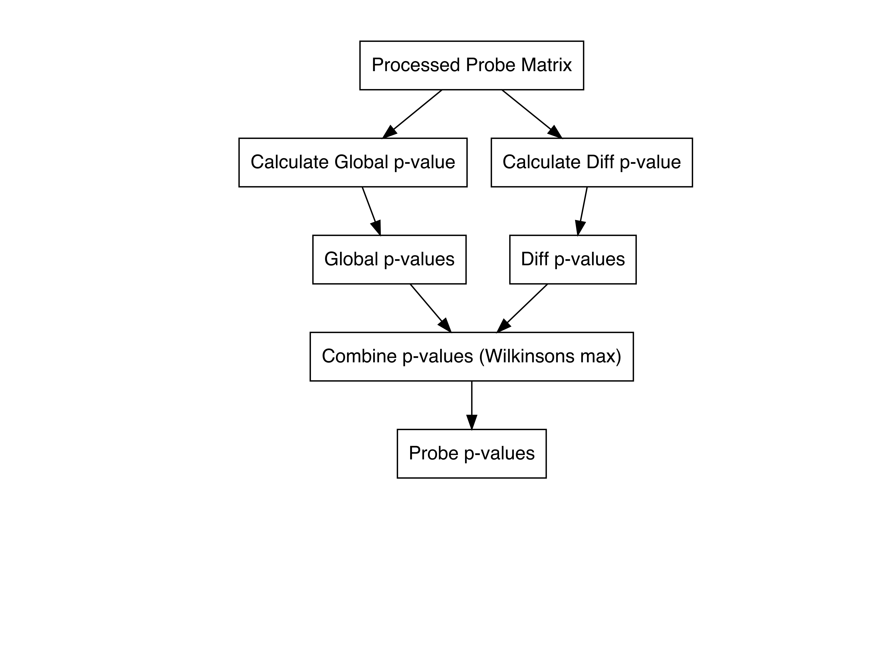

<!-- README.md is generated from README.Rmd. Please edit that file -->

# HERON

<!-- badges: start -->
<!-- badges: end -->

The goal of HERON (**H**ierarchical **E**pitope P**R**Otein Bi**N**ding)
is to anayzing peptide binding array data.

## Installation

You can install the released version of HERON from
[github](https://github.com/Ong-Research/HERON) with:

``` r
devtools::install_github("Ong-Research/HERON")
```

And the development version from
[GitHub](https://github.com/Ong-Research/HERON) with:

``` r
# install.packages("devtools")
devtools::install_github("Ong-Research/HERON")
```

# Flowchart of probe p-value calculations



## Example

These are examples which shows you how to interact with the code. We
will be using the COVID-19 peptide binding array dataset from <TODO>
this publication.

### Download Data

``` r

##Probe Meta
sequences_url = "https://dholk.primate.wisc.edu/_webdav/dho/sequencing/Polypeptide%20Microarrays/public/COVID_19/%40files/all_sequences_except_wi.tsv.gz?contentDisposition=attachment"
sequences_path = "all_sequences_except_wi.tsv.gz"

if (!file.exists(sequences_path)) {
    download.file(sequences_url, sequences_path);
}
probe_meta = UW.Adult.Covid.19::loadProbeMeta(sequences_path)

##SeqMat Data
stacked_df_url = "https://dholk.primate.wisc.edu/_webdav/dho/sequencing/Polypeptide%20Microarrays/public/COVID_19/%40files/aggregated_data/df_stacked.tsv.gz?contentDisposition=attachment"
stacked_df_path = "df_stacked.tsv.gz"

if (!file.exists(stacked_df_path)) {
    options(timeout = max(300, getOption("timeout")))

    download.file(stacked_df_url, stacked_df_path);
}

seq_mat = UW.Adult.Covid.19::loadSeqMat(file_name = stacked_df_path);
sample_meta = attr(seq_mat, "sample_meta");
```

### Pre-process data

``` r


## Quantile normalize
seq_mat_qn = UW.Adult.Covid.19::normalizeQuantile(seq_mat[,-1])

probe_meta = probe_meta[probe_meta$PROBE_SEQUENCE %in% rownames(seq_mat_qn),]
seq_mat_qn = seq_mat_qn[rownames(seq_mat_qn) %in% probe_meta$PROBE_SEQUENCE,]


## Create pData data.frame
create_pData<-function(mat_in) {
  
  
  pData = data.frame(
    Sample_ID = colnames(mat_in),
    ptid = colnames(mat_in),
    visit = "pre",
    condition = "Control",
    stringsAsFactors=FALSE
  );
  pData$condition[pData$Sample_ID %in% sample_meta$SAMPLE_NAME[sample_meta$COVID_POSITIVE == "YES"]] = "COVID";
  pData$visit[pData$condition == "COVID"] = "post"
  pData$TAG = pData$Sample_ID;
  
  return(pData);
}

pData = create_pData(seq_mat_qn)
```

### Calculate Probe-level p-values

``` r
library(HERON)
probe_pvalue_res <- calcProbePValuesSeqMat(seq_mat_qn, probe_meta, pData, t.abs_shift = 1, use="t", make.plots = FALSE);
#> differential t-test
#> adjusting using BH
#> Generating seq_to_probe
#> 
#> Generating seq_to_probe
```

### Obtain probe-level calls

``` r
probe_calls_res <- makeProbeCalls(probe_pvalue_res, probe_cutoff = 0.05, one_hit_filter = TRUE)
#> Hit support
#> Applying one-hit filter
#> removing 97004 out of 101378 k1 probes
```

### Find Epitope Segments using the unique method

``` r
epitope_segments_unique_res <- findEpitopeSegmentsUnique(probe_calls_res)
```

### Calculate Epitope-level p-values

Let’s just do the Wuhan proteins for now.

``` r
Wu1_segments <- epitope_segments_unique_res[grep("NC_045512.2", epitope_segments_unique_res)]
```

Calculate epitope p-values using Wilkinson’s max meta p-value method.

``` r
epitope_pvalues_unique <- calcEpitopePValues(attr(probe_pvalue_res, "pvalue"), epitope_ids = Wu1_segments, method = "max")
epitope_padj_unique <- p_adjust_mat(epitope_pvalues_unique, method="BH")
```

### Obtain Epitope-level calls

Can use the makeCalls function for this.

``` r
epitope_calls_unique <- makeCalls(epitope_padj_unique)
```

### Calculate Protein-level p-values

Calculate protein p-values using Tippet’s (Wilkinson’s Min) meta p-value
method.

``` r
protein_pvalues_unique = calcProteinPValuesE(epitope_pvalues_unique, method = "tippets")
protein_padj_unique = p_adjust_mat(protein_pvalues_unique, method = "BH")
```

### Obtain Protein-level calls

``` r
protein_calls_unique <- makeCalls(protein_padj_unique)
```

### Find Epitope Segments using skater method

``` r

if (FALSE) {
epitope_segments_skater_res = findEpitopeSegments(probe_pvalue_res, probe_calls_res,
                                                  segment.method = "skater",
                                                  segment.score.type = "binary",
                                                  segment.dist.method = "hamming",
                                                  segment.cutoff = "silhouette")
}                                            
                                    
```

End of example
